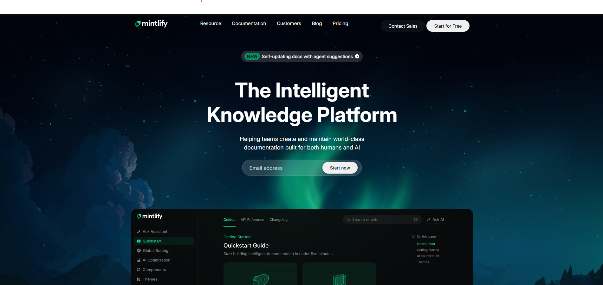

# Mintlify Landing Page Clone

  
  


A **modern, responsive landing page clone of Mintlify**, built with **HTML5** and **CSS3 (Flexbox & Grid)**. This project recreates the core sections, layout, and user experience of the original Mintlify landing page, focusing on clean design and responsiveness.

**Live Demo:** [Mintify Landing Page](https://mintlify-clone-landing-page.netlify.app)

---

## Table of Contents

- [About](#about)  
- [Sections Implemented](#sections-implemented)  
- [Screenshots / Preview](#screenshots--preview)  
- [Technologies Used](#technologies-used)  
- [How to Run Locally](#how-to-run-locally)  

---

## About

This project is a **replica of the Mintlify landing page**. The goal was to **recreate the overall structure, design, and interactive feel** using core web technologies.

- Colors, typography, and layout closely match the original Mintlify site.

---

## Sections Implemented

The landing page includes the following sections:

1. **Top Navigation Bar**  
   - Logo, navigation links, and primary call-to-action button.

2. **Hero Section**  
   - Main headline, short description, email input, CTA button, and large background illustration.

3. **Documentation Preview Section**  
   - Sidebar-style static navigation with main content cards.

4. **Trusted By / Logos**  
   - Row of company logos showcasing trust and credibility.

5. **Feature Highlights**  
   - Two-column layout sections combining text and visuals.

6. **Intelligent Assistant / UI Preview**  
   - Large UI mockup accompanied by descriptive text.

7. **Enterprise Features Section**  
   - Title, short intro, and feature blocks covering security, compliance, and more.

8. **Case Studies / Customer Stories**  
   - Card-based layout with images and brief descriptions.

9. **Final Call-To-Action**  
   - Strong heading with prominent CTA buttons.

10. **Footer**  
    - Multi-column navigational links with company and legal information.

---

## Screenshots / Preview



Or see the **Live Demo**: [Mintlify Landing Page](https://mintlify-clone-landing-page.netlify.app)

---

## Technologies Used

- **HTML5**  
- **CSS3 (Flexbox & Grid)**  

---

## How to Run Locally

To run the Mintlify Landing Page locally:

1. **Clone the repository:**

    ```bash
    git clone https://github.com/jayeshvaghela-dev/mintlify-clone.git
    ```

2. **Navigate to the project directory:**

    ```bash
    cd mintlify-clone
    ```

3. **Open the project:**

    - Open `index.html` directly in your browser, **or**  
    - Use a live server extension (like **Live Server** in VS Code) for live preview and hot reload.
